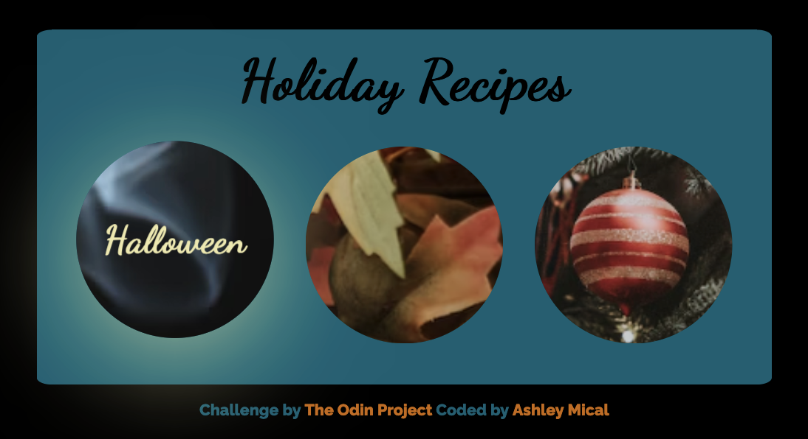

# Odin Recipes Website

## Table of contents

- [Overview](#overview)
  - [Screenshot](#screenshot)
  - [Links](#links)
- [My process](#my-process)
  - [Built with](#built-with)
  - [What I learned](#what-i-learned)
  - [Continued development](#continued-development)
- [Author](#author)

## Overview

### Screenshot

### Links

- Solution URL: [GitHub Project Page](https://github.com/micamash/odin-recipes)
- Live Site URL: [Recipes Project](micamash.github.io/odin-recipes/)

## My process

### Built with

- Semantic HTML5 markup
- CSS custom properties
- Flexbox
- CSS Grid
- Mobile-first workflow

### What I learned

This project was started during the HTML course on The Odin Project. I continued to build on this website as I progressed in the program using CSS and responsive web design.

### Continued development

I plan to continue practicing responsive design as well as my HTML/CSS skills.

## Author

- Website - [My GitHub](https://github.com/micamash)
- [The Odin Project](https://www.theodinproject.com)
